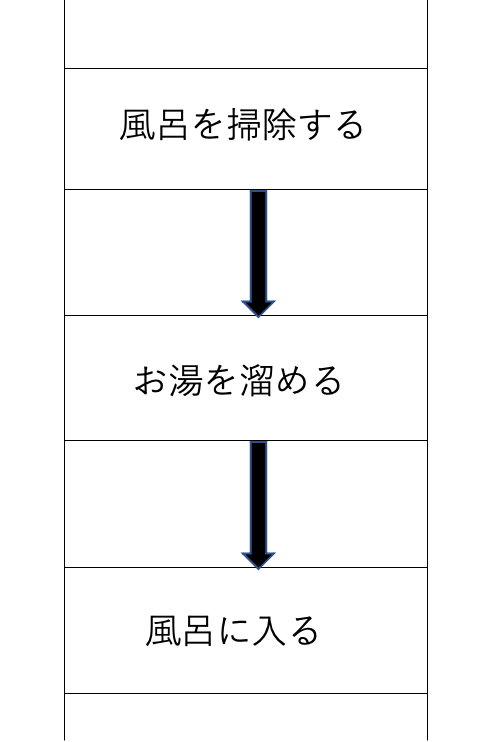

## void
void 0は何を返すのか

→常にUndefinedを返してくれる演算子
- ()の中は何でも良いが(0)が一般的に定着している
- aタグで遷移させずにアクションをさせたい時に昔使っていたが、見栄えの問題で今は使われてない
- 詳しくはhttps://techplay.jp/column/559

## e.stopPropagination()
→親要素へのイベントの伝搬をキャンセルする
- クリックなどのイベントは、子要素から親要素へと伝播される（バブリング）
- preventDefault()は、その要素のイベントをキャンセルする
- return false;は、その要素のイベントも親要素への伝播もキャンセルする

## for~inとfor~ofの違い
* for ~ in
 
`for (var n in [0, 2, 4, 6, 8, 10]) console.log(n); // 0 1 2 3 4 5`
 - つまりnは「index」
 - for – in文」はJavaScriptの実行環境やブラウザのバージョンによって、必ず要素の順番通りに出力されることが保証されてない！
  
* for ~ of__
 
`for (var n of [0, 2, 4, 6, 8, 10]) console.log(n); // 0 2 4 6 8 10`
- つまりnは「value」

## JavaScriptの処理
* シングルスレッド。単一に処理を行う。
 

- 重い処理が間に挟まると、効率が非常に悪い

